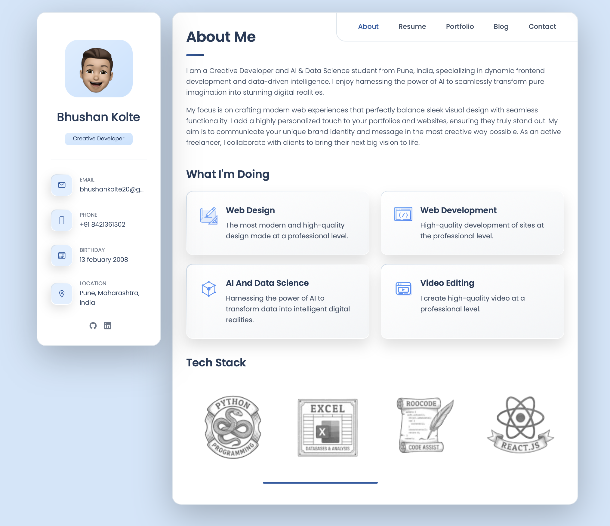

# Bhushan Kolte - Personal Portfolio

A modern, responsive, and beautifully designed personal portfolio website built to showcase my skills, experience, and projects as a Creative Developer.

## 📸 Preview



## ✨ Features

- **About Me**: A brief introduction, personal details, and a summary of what I do.
- **Resume**: Detailed timeline of my education, experience, and skills.
- **Portfolio**: A showcase of my recent projects with interactive filtering capabilities.
- **Contact**: A dedicated section to get in touch, including social links and location details.
- **Fully Responsive**: Adapts seamlessly to all device sizes (mobile, tablet, desktop).
- **Modern UI/UX**: Clean layout, glassmorphism effects, smooth animations, and intuitive navigation.

## 🛠️ Technologies Used

- **HTML5**: For semantic structuring of the content.
- **CSS3**: For styling, layout (Flexbox/Grid), custom properties (variables), and animations.
- **JavaScript (Vanilla)**: For interactive elements such as tab navigation, modal toggles, and portfolio filtering.
- **Ionicons**: For clean and lightweight scalable icons.
- **Google Fonts**: Custom typography using the 'Poppins' font family.

## 🚀 Getting Started

To view the project locally, you don't need any complex build tools. Simply clone the repository and open the `index.html` file in your web browser.

### Prerequisites

- A modern web browser (Google Chrome, Mozilla Firefox, Safari, or Microsoft Edge).

### Installation

1. Clone the repository:
   ```bash
   git clone https://github.com/skyiekoltepatil/my-portfolio.git
   ```
   *(Note: Replace with your actual repository URL if different)*

2. Navigate to the project directory:
   ```bash
   cd My-Portfolio-Live
   ```

3. Open `index.html` in your browser:
   - You can simply double-click the `index.html` file.
   - Alternatively, for a better development experience, you can use an extension like [Live Server](https://marketplace.visualstudio.com/items?itemName=ritwickdey.LiveServer) in VS Code.

## 🤝 Connect with Me

Feel free to reach out for collaborations or just a friendly chat!

- **Email**: [bhushankolte20@gmail.com](mailto:bhushankolte20@gmail.com)
- **LinkedIn**: [Bhushan Kolte](https://www.linkedin.com/in/bhushan-kolte-458561380/)
- **GitHub**: [@skyiekoltepatil](https://github.com/skyiekoltepatil)

## 📄 License

This project is open-source and available for anyone to learn from, use, and modify.
